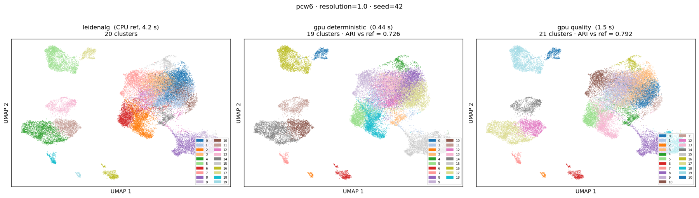
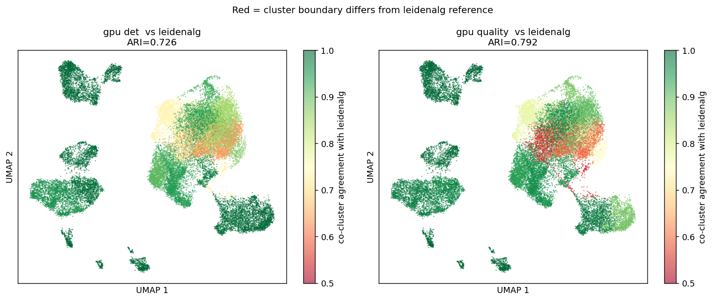

# sjanpy

[](https://www.python.org)
[](https://opensource.org/licenses/MIT)

**Subjacent Analysis Toolkits for Single-Cell Omics in Python**

sjanpy extends the [Scanpy](https://scanpy.readthedocs.io/) / [AnnData](https://anndata.readthedocs.io/) ecosystem with publication-quality visualizations, fast differential expression analysis, and preprocessing utilities for single-cell RNA-seq.

## Package Structure

sjanpy follows the Scanpy subpackage convention:

| Subpackage | Purpose | Key Functions |
|---|---|---|
| `sjanpy.pl` | **Plotting** | Embedding, dot plot, bar plot, volcano plot, Nebulosa density |
| `sjanpy.tl` | **Tools** | GPU Leiden clustering, differential expression, Pearson residuals normalization |
| `sjanpy.pp` | **Preprocessing** | Gene filtering, stratified splitting, HVG selection |
| `sjanpy.ml` | **Machine Learning** | h5ad I/O, standardization pipeline, dataset builder (safetensors/pt), GPU/streaming datasets, embedding evaluation |

## Installation

```bash
git clone https://github.com/chansigit/sjanpy.git
cd sjanpy
pip install .
```

## Quick Start

### GPU-accelerated Leiden clustering

`sjanpy.tl.gpuleiden` is a drop-in replacement for `scanpy.tl.leiden` backed
by the [`gpu_leiden`](https://github.com/chansigit/gpu-leiden) CUDA kernel.
It is **3–10× faster** than leidenalg and reaches comparable modularity via
an optional quality flavor with iterated local search.

```python
import scanpy as sc
import sjanpy

adata = sc.datasets.pbmc3k_processed()
sc.pp.neighbors(adata)

# deterministic — bit-reproducible, ~10x faster than leidenalg
sjanpy.tl.gpuleiden(adata, resolution=1.0, random_state=42)

# quality — ILS shake-kick; closes most of the modularity gap to leidenalg
sjanpy.tl.gpuleiden(adata, resolution=1.0, random_state=42,
                    gpu_flavor="quality", n_restarts=4,
                    key_added="leiden_quality")
```

Check availability at runtime (safe on CPU-only machines):

```python
if sjanpy.tl.GPU_LEIDEN_AVAILABLE:
    sjanpy.tl.gpuleiden(adata, resolution=1.0)
else:
    sc.tl.leiden(adata, resolution=1.0)   # CPU fallback
```

**UMAP comparison** on pcw6 (28,630 cells, `resolution=1.0`, `seed=42`):



| Method | Clusters | Time | ARI vs leidenalg |
|---|---|---|---|
| leidenalg (CPU) | 20 | 4.2 s | 1.000 |
| gpu deterministic | 19 | **0.44 s** | 0.726 |
| gpu quality | 21 | **1.5 s** | 0.792 |

The heatmap below shows per-cell co-cluster agreement with leidenalg
(green = same grouping, red = boundary differs). The quality flavor (right)
recovers finer structure in ambiguous boundary regions compared with the
deterministic run (left):



Requires [`gpu_leiden`](https://github.com/chansigit/gpu-leiden) — see its
README for build and install instructions (CUDA ≥ 12.0, sm_80+).

### Embedding visualization

```python
import scanpy as sc
from sjanpy.pl import fancy_embedding_pro

adata = sc.datasets.pbmc3k_processed()
fancy_embedding_pro(adata, basis='umap', color='louvain')
```

### Differential expression

```python
from sjanpy.tl import fast_two_group_deg
from sjanpy.pl import plot_volcano

deg = fast_two_group_deg(adata, label_col='louvain', lst1=['B cells'], lst2=['CD4 T cells'])
plot_volcano(deg, logfc_col='log2FC', padj_col='padj')
```

### Nebulosa density

Traditional scatter plots obscure gene expression patterns due to point overlap. Nebulosa uses weighted kernel density estimation to reveal true expression distributions:

```python
from sjanpy.pl import nebulosa_density

nebulosa_density(adata, coord_key='X_umap', gene='CD3D', show=True)
```

| Standard scatter | Nebulosa density |
|---|---|
|  |  |

### Embedding evaluation (scIB + scGraph)

```python
from sjanpy.ml.eval import (
    load_latent, load_split_obs, build_knn_graph,
    scib_metrics, scgraph_score,
)

latent = load_latent("outputs/my_run")               # (n_cells, n_latent)
obs = load_split_obs("data/ds_skin")                  # batch, cell_type, ...

# scIB benchmark: 9 metrics + overall score (~5s on H100)
knn_idx, knn_dist = build_knn_graph(latent, n_neighbors=90)
results = scib_metrics(latent, obs, knn_indices=knn_idx, knn_distances=knn_dist)
print(results["overall_score"])   # 0.4 * batch_score + 0.6 * bio_score

# scGraph benchmark: centroid distance correlation (~2s)
sg = scgraph_score(latent, adata_path="data/ds_skin")
print(sg["corr_weighted"])        # main scGraph metric
```

### Gene filtering

```python
from sjanpy.pp import filter_human_sc_genes

# Mask artifact genes from HVG selection (predicted, non-coding, IG variable, etc.)
adata = filter_human_sc_genes(adata, mask_hvg_only=True)
```

### Complex dot plot

```python
from sjanpy.pl import complex_dotplot

complex_dotplot(
    adata,
    genes=marker_genes,
    groupby='cell_type',
    z_score=True,
    cluster_rows=True,
    cmap='RdBu_r',
)
```

## Module Reference

### `sjanpy.pl` — Plotting

| Function | Description |
|---|---|
| `fancy_embedding_pro` | UMAP/t-SNE with density overlays, auto-labels, equal-aspect axes |
| `complex_dotplot` | Dot plot with hierarchical clustering and dendrograms |
| `fan_dotplot` | Polar/radial dot plot layout |
| `plot_stacked_bar_repel` | Stacked bar plot with smart label placement |
| `plot_volcano` | Volcano plot for DEG visualization |
| `plot_cluster_deg_jitter_highlight` | Per-cluster jitter plot with gene annotations |
| `nebulosa_density` | Weighted KDE density on embeddings |
| `wkde2d` / `wkde3d` | Low-level 2D/3D weighted kernel density estimation |

### `sjanpy.tl` — Tools

| Function / Class | Description |
|---|---|
| `gpuleiden` | GPU Leiden clustering — drop-in for `sc.tl.leiden` (requires `gpu_leiden`) |
| `GPU_LEIDEN_AVAILABLE` | `bool` flag — `True` when `gpu_leiden` is installed |
| `fast_two_group_deg` | Vectorized Welch's t-test DEG between two groups |
| `compute_nested_deg_df` | Within-cluster DEG between two conditions |
| `clip_logfc_in_nested_deg_df` | Per-cluster quantile clipping of logFC |
| `generate_highlight_dict` | Select genes to label (top-N, k-times, manual) |
| `PearsonResidualsScaler` | NB-based Pearson residuals normalization |

### `sjanpy.pp` — Preprocessing

| Function | Description |
|---|---|
| `filter_human_sc_genes` | Remove/mask artifact genes (human) |
| `filter_mouse_sc_genes` | Remove/mask artifact genes (mouse) |
| `filter_rat_sc_genes` | Remove/mask artifact genes (rat) |
| `get_background_gene_dict` | Catalog artifact gene categories in a dataset |
| `stratified_split` | Two-stage stratified train/val/test splitting |
| `prepare_hvg_sample` | Stratified subsample of training cells for HVG computation |
| `compute_hvg` | Highly-variable gene selection with stratified sampling |

### `sjanpy.ml` — Machine Learning

#### h5ad I/O (`sjanpy.ml.h5ad_io`)

| Function | Description |
|---|---|
| `read_obs` / `read_var` | Read obs/var DataFrames from h5ad via h5py |
| `locate_matrix` | Locate expression matrix path in h5ad |
| `get_matrix_shape` | Get matrix dimensions without loading data |
| `read_matrix_rows` | Read specific rows from dense/sparse matrices |
| `read_sparse_chunk` | Read a chunk of a sparse matrix as CSR |
| `validate_matrix_values` | Validate matrix values (NaN, Inf checks) |

#### Standardization (`sjanpy.ml.standardize`)

| Function | Description |
|---|---|
| `build_standardized_h5ads` | Build per-split standardized h5ad files (accumulate or streaming) |
| `build_standardized_obs` | Build standardized obs with split assignments |

#### Dataset Building (`sjanpy.ml.build_dataset`)

| Function | Description |
|---|---|
| `build_dataset` | Stream h5ad → safetensors or chunked `.pt` files with condition vectors |
| `build_condition_schema` | Build encoding schema from condition DSL specs |
| `process_file` / `process_file_safetensors` | Process a single h5ad file into chunks |
| `load_gene_list` / `resolve_gene_indices` | Gene list loading and index resolution |
| `save_condition_schema` / `load_condition_schema` | Condition schema persistence (supports `batch_key`) |

The `--batch-key` argument records which obs column defines batch identity in the condition schema. This is propagated to downstream model creation and evaluation, so that integration metrics (scIB) use the correct batch grouping regardless of how batch is encoded in the condition vector:

```bash
python -m sjanpy.ml.build_dataset \
    --h5ad-input train.h5ad --output safetensors_groupmean/ \
    --numerical-cond "library_size:log1p:zscore" \
    --cat-cond "biosample_id:groupmean(library_size:log1p)" \
    --batch-key batch \
    --save-schema safetensors_groupmean/condition-schema.json
```

#### Embedding Evaluation (`sjanpy.ml.eval`)

GPU-accelerated, self-contained metrics for benchmarking latent embeddings. No C extensions or JAX needed.

| Function | Description |
|---|---|
| `build_knn_graph` | kNN via GPU matmul (cosine) or pynndescent (any metric), auto-selected |
| `knn_to_sparse` | Convert kNN arrays to sparse connectivity matrix |
| `fit_umap` | UMAP with precomputed kNN support |
| `scib_metrics` | **9 scIB metrics + overall score** (Luecken et al., *Nat Methods* 2022) |
| `scgraph_score` | **Corr-Weighted / Corr-PCA / Rank-PCA** (Wang et al., *Nat Biotech* 2025) |
| `batch_integration_report` | Quick report: ASW + graph connectivity + Leiden NMI/ARI |
| `lisi` / `ilisi` / `clisi` | Local Inverse Simpson's Index (GPU-accelerated, validated vs scib) |
| `kbet` | k-nearest-neighbor Batch Effect Test (vectorized chi-squared) |
| `batch_asw` / `celltype_asw` | Silhouette scores with GPU pairwise distances |
| `graph_connectivity` | Per-label connected components (scIB-compatible) |
| `leiden_nmi_ari` | Leiden clustering + NMI/ARI vs true labels |
| `load_latent` / `load_split_obs` | Load embeddings and metadata from run directories |
| `subsample_indices` | Random subsample for O(n^2) operations |

#### Dataset Classes (`sjanpy.ml.dataset`)

| Class | Description |
|---|---|
| `GPUDataset` | Preload entire dataset to GPU for zero-transfer training |
| `StreamingDataset` | Stream from disk via mmap for datasets that don't fit in RAM |

## Dependencies

Core: `numpy`, `pandas`, `scipy`, `matplotlib`, `seaborn`, `scanpy`, `anndata`, `adjustText`, `statsmodels`, `scikit-learn`

Optional: `plotly` (3D visualization), `torch` / `h5py` / `safetensors` (ML pipeline), `pynndescent` / `umap-learn` (eval kNN/UMAP), `torch`+CUDA (GPU-accelerated kNN, pairwise distances, LISI)

## License

MIT
